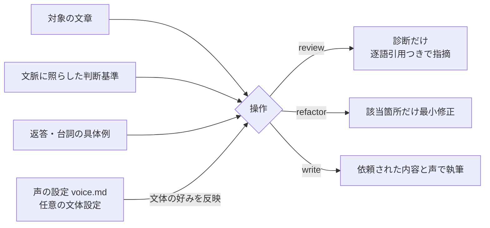

<p align="center">
  
  <br>
  <sub><em>均一に刷られた文章の中から必要な箇所だけを直し、書き手の声を戻す世界を表しています。</em></sub>
</p>

# unai

[](https://github.com/kitepon/unai/actions/workflows/ci.yml)
[](https://github.com/kitepon/unai/releases)
[](LICENSE)

**日本語** · [English](README.en.md)

> **書き手の声はそのままに、日本語のAIっぽさを取り除く。**
> unaiは、日本語の不自然な定型表現を診断し、内容と書き手の声を保って最小修正するagent skillです。Claude Code、Codex、Grok、Cursorで動きます。

[kitepon.dev](https://kitepon.dev/#systems)所属の[クオ](https://x.com/QLyun35332)が開発・運営しています。

現在のreleaseは **unai 0.5.0** です。

## 30秒でできること

```text
/unai review 下書き.md        # 問題箇所を診断する。文章は変更しない
/unai refactor 下書き.md      # 該当箇所だけを最小修正する
記事を書いて。unaiに従って     # 執筆時から規範を適用する
```

`review`は根拠と逐語引用を返し、`refactor`は指摘した箇所だけを直します。全文を別の文章へ
作り替えないので、元の主張、情報、構成、書き手の癖を残せます。

## 何を直すのか

unaiが扱うのは、文脈に合わない定型表現や機械的な繰り返しです。単語や文型を見つけただけで
「AIっぽい」と判定せず、その文章で何を伝えているかを見て、該当箇所を直します。

- 手順を聞かれた返答に付いた、話題と結びつかない称賛や一般論
- 実際には対立していないものを強調する対比や、内容が増えない言い直し
- 内容に関係なく繰り返される前置き、列挙、まとめ
- 具体的な説明の代わりに置かれた、大げさで意味の曖昧な言葉

理由、条件、具体例、必要な説明と、書き手の声を保ちます。要約や構成変更は依頼された場合に行い、
返答の行数や会話の進め方は決めません。

可愛いキャラクター、感情、冗談、比喩、絵文字、口癖も、その人らしさを伝える表現です。
設定がなくても残します。たとえば、喜ぶ台詞の「やったぁ、できたよっ！ えへへ🌸」を
「完了しました。」に直すのは、unaiの目的に反します。

判断基準と、直す例・残す例は [core-pass.md](skills/unai/references/core-pass.md)、
返答や台詞の例は [chat-replies.md](skills/unai/references/domains/chat-replies.md) を参照してください。
AIが書いたかどうかを検出する製品ではありません。

## インストール

### Claude Code

```bash
claude plugin marketplace add kitepon/unai
```

続けて対話中に `/plugin` からunaiをインストールするか:

```bash
claude plugin install unai@unai
```

### Codex / Grok / Cursor（Claude Codeでも可）

```bash
curl -fsSL https://raw.githubusercontent.com/kitepon/unai/main/install.sh | bash
```

Windows nativeではPowerShell 7から実行します。

```powershell
irm https://raw.githubusercontent.com/kitepon/unai/main/install.ps1 | iex
```

Claude Code、Codex、Grok、Cursorの4つの部品置き場（`~/.claude/skills/unai` 等）へ繋ぎ込みます。更新は同じ1行の再実行です。

Codexは公式のuser skill面`~/.agents/skills/unai`だけへ配置します。旧Codexで`~/.codex/skills/unai`が必要な場合だけ、取得済みinstallerを`--profile legacy`（Windowsは`-Profile legacy`）付きで実行してください。公式面と旧面は同時に配置しません。

macOS / Linuxで旧面を明示する例:

```bash
bash "${XDG_DATA_HOME:-$HOME/.local/share}/unai/install.sh" --profile legacy
```

Windowsで旧面を明示する例:

```powershell
& "$env:LOCALAPPDATA\unai\install.ps1" -Profile legacy
```

外すときは、導入したOSの入口を使います。skillとCLIの繋ぎ込みだけを外し、取得したrepoは残します。

macOS / Linux:

```bash
bash "${XDG_DATA_HOME:-$HOME/.local/share}/unai/install.sh" --uninstall
```

Windows（上の1行で導入した場合）:

```powershell
& "$env:LOCALAPPDATA\unai\install.ps1" -Uninstall
```

手元のcloneから導入した場合は、そのcloneにある`install.sh --uninstall`または`install.ps1 -Uninstall`を実行してください。現在のinstallerは、そのcloneを指しているskillとCLIだけを外します。同じ所有権判定を備えた別versionのcloneから最新版へ張り直した後なら、古いclone側のuninstallで現在の配線は消えません。

この判定を含まない過去tagのinstallerを使う場合は、実行前にskillとCLIのリンク先を確認してください。すでに別cloneを指しているなら、その過去installerでuninstallせず、残った過去cloneだけを削除します。

### 「実ファイルがあるため上書きしない」と出たとき

installerは、skillの配置先やCLIの配置先に通常のファイル／ディレクトリがあると、それを消さずに保持します。配布bundleと一致しないskillや利用者のCLIが残れば、診断JSONを出して非0終了し、成功とは表示しません。まず表示された対象が自分の資産かを確認し、必要なら名前を変えて退避してからinstallerをもう一度実行してください。リンクやジャンクションなら`LinkType`／`Target`も確認できます。

macOS / Linuxの例:

```bash
ls -ld ~/.agents/skills/unai ~/.local/bin/unai
unai_conflict="$HOME/.agents/skills/unai"
mv "$unai_conflict" "$unai_conflict.before-unai"
curl -fsSL https://raw.githubusercontent.com/kitepon/unai/main/install.sh | bash
```

Windowsの例:

```powershell
Get-Item -Force "$HOME\.agents\skills\unai", "$HOME\.local\bin\unai.ps1" |
  Format-List FullName, LinkType, Target, Attributes
$unaiConflict = "$HOME\.agents\skills\unai"
Move-Item -LiteralPath $unaiConflict -Destination "$unaiConflict.before-unai"
irm https://raw.githubusercontent.com/kitepon/unai/main/install.ps1 | iex
```

競合しているのがCLIなら、同じ手順で`~/.local/bin/unai`（Windowsは`~/.local/bin/unai.ps1`）を退避します。退避物を削除するか統合するかは、中身を確認してから決めてください。

installerは`unai` CLIも`~/.local/bin`へ配置します。版数と工場向けread-only診断は次の入口です。

```bash
unai --version
unai factory-diagnostics --json
```

### 工場向けread-only診断の契約

`factory-diagnostics --json`は、unai自身のmanifest・実行環境・skill bundleと4ホストへの投影を読む診断入口です。成功・不成功のどちらでも、診断が実行できた場合はstdoutへ1行のJSONを返します。legacy Codex面を使う場合は`--profile legacy`を加えます。

```json
{
  "schema": "unai.native_factory_diagnostics.v2",
  "product": { "name": "unai", "version": "0.5.0" },
  "checks": {
    "manifest_consistency": "pass",
    "node_runtime": "pass",
    "skill_bundle": "pass",
    "skill_projections": {
      "claude": "ready",
      "codex": "ready",
      "grok": "ready",
      "cursor": "ready"
    }
  },
  "overall": "ready"
}
```

top-level fieldは`schema`、`product`、`checks`、`overall`の4つだけです。

| field | 契約 |
|---|---|
| `schema` | 常に`unai.native_factory_diagnostics.v2` |
| `product` | `name`は`unai`、`version`はplugin manifestのSemVer |
| `checks` | 3つの製品checkと`skill_projections` |
| 製品checkのstatus | `pass`または`fail`。top-levelの`status` fieldはありません |
| projectionのstatus | 各hostは`ready`、`missing`、`stale`、`conflict`のいずれか |
| `overall` | 3つの製品checkが`pass`かつ4面が`ready`なら`ready`、それ以外は`not_ready` |

- `manifest_consistency`: plugin manifestとmarketplace manifestの名前・版数・sourceが一致している
- `node_runtime`: 実行中のNode.jsが`package.json`の`engines.node`（現在は`>=22.13`）を満たす
- `skill_bundle`: 配布に必要なskill本体と参照文書を読める
- `skill_projections`: Claude Code、Codex、Grok、Cursorの配置先が現在のbundleを使っている

projectionは、この製品bundleを直接指すsymlink／junction、または内容が完全一致するdirectory copyだけが`ready`です。配置先がなければ`missing`、実体directoryの内容が古いかdangling linkなら`stale`、通常file、別bundleへのlink、Codexの公式面とlegacy面の同居は`conflict`です。絶対pathはJSONへ出しません。

| exit | stdout / stderr | 意味 |
|---|---|---|
| `0` | stdoutに診断JSON | `overall: "ready"` |
| `1` | stdoutに診断JSON | `overall: "not_ready"` |
| `2` | stderrにusage、診断JSONなし | 引数が不正 |

この診断は校正対象の文章、利用履歴、絶対path、secretを読み取りも出力もしません。

## 使い方

```
/unai review 下書き.md        # 診断だけ（編集しない）
/unai refactor 下書き.md      # 該当箇所だけ最小修正
記事を書いて。unaiに従って     # 執筆時に最初から適用
```

AIからも呼べます。文章を書く作業の中で「unaiに従う」と指示されれば、AIが自分の出力に適用します。

### 適用範囲は3段階から選ぶ

1. **使う時だけ**（既定）: 導入しただけでは何も起きません。上の使い方のように呼んだ時だけ働きます
2. **特定のプロジェクトだけ常時**: そのプロジェクトの指示ファイルに下の1行を書くと、そのフォルダでの作業だけ言わなくても常時効きます。ブログのrepoにだけ効かせたい、といった使い方はこれです
3. **全部に常時**: ホストの共通指示に同じ1行を足すと、そのAIの全ての文章仕事に効きます

```
文章・返答の文体はunai skillの規範に従う。
```

1行を書く場所（ホスト別）:

| ホスト | プロジェクトだけ（2） | 全部（3） |
|---|---|---|
| Claude Code | `CLAUDE.md` | `~/.claude/CLAUDE.md` |
| Codex | `AGENTS.md` | `~/.codex/AGENTS.md` |
| Grok Build | `AGENTS.md` | `~/.grok/rules/AGENTS.md` |
| Cursor | `AGENTS.md` または `.cursor/rules/` | `~/.cursor/rules/` の規則ファイル |

置き場はホストの版によって変わることがあります。合わない場合は、そのホストの説明書で「指示ファイル／ルールファイル」の場所を確認してください。

## 声の設定（voice profile）

声の設定は任意です。設定がなくても、原文や会話で指定された口調・キャラクターを保ちます。繰り返し使う好みは `~/.unai/voice.md`（プロジェクト固有なら `.unai/voice.md`）に書けます。現在の依頼を優先し、文体の好みは一般的な判断基準より優先します。

```markdown
# 私の声
- 一人称は「俺」。読者へ向けた告知は「です・ます」基調で、
  文体は自分の過去の投稿を手本にする。
- 読者は技術に詳しくない人も含む。専門用語は日本語の動きで説明する。
- 軽い冗談は可。
```

一人称、相手との関係、好きな表現や実際の文章を手本として添えてもよいでしょう。書いていない表現が禁止になることはありません。書き方の詳細は [skills/unai/references/voice-profile.md](skills/unai/references/voice-profile.md)。

## 仕組み



## 構成

- `skills/unai/SKILL.md` — 操作（review / refactor / write）と手順
- `skills/unai/references/core-pass.md` — 文脈に照らす判断基準と対になる例
- `skills/unai/references/domains/chat-replies.md` — 返答・台詞で直す例と残す例
- `skills/unai/references/voice-profile.md` — 声の設定の書き方
- `AGENTS.md` — 製品の所有境界と文書管理
- `RELEASE.md` — リリースと版固定による復旧の契約

文章規範の変更に使う[動作確認例](tests/prose-cases.md)には、説明・感情・キャラクターを保つ場合と、定型表現を直す場合の両方を含めています。

## ライセンス

MIT

## サポートとセキュリティ

使い方や不具合は [GitHub Issues](https://github.com/kitepon/unai/issues) へ。脆弱性の報告は公開Issueへ書かず、[セキュリティポリシー](SECURITY.md) に従ってください。
