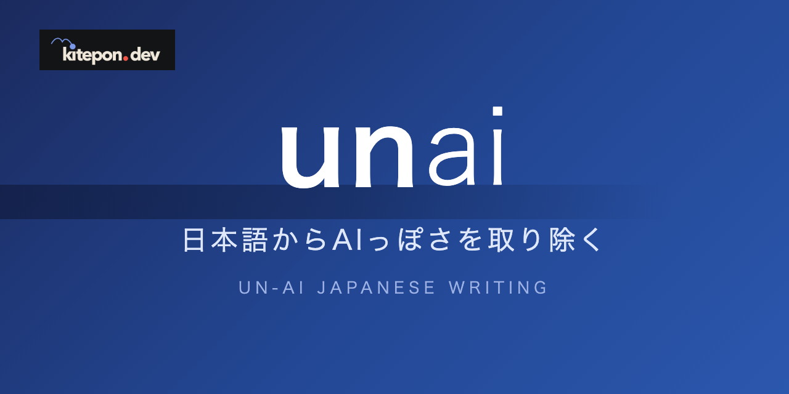
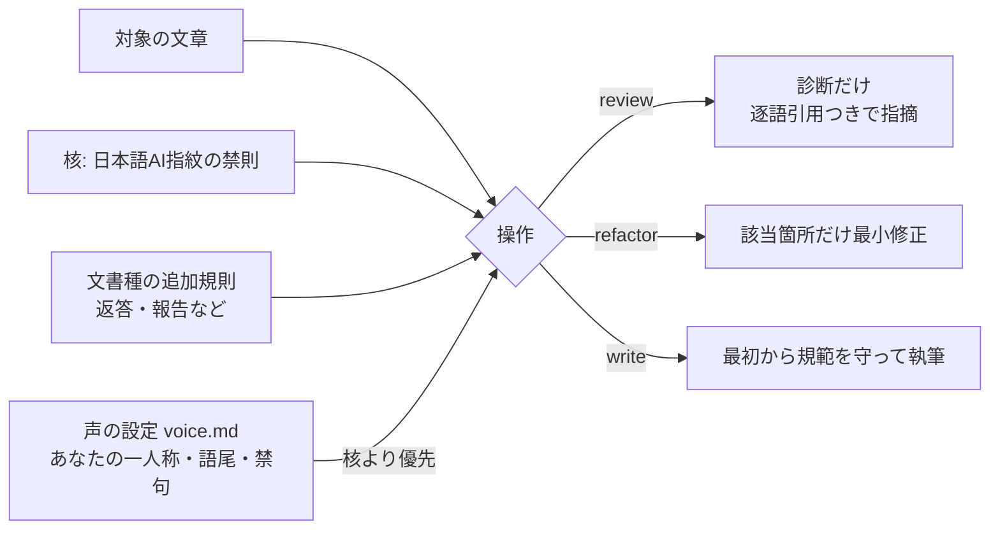

<p align="center"></p>

<p align="center"><a href="https://kitepon.dev/#systems"></a></p>
<p align="center"><strong>kitepon.dev の AI Development System</strong></p>

# unai — 日本語文章からAIっぽさを取り除く

> AIが書いた日本語の「AIっぽさ」を診断し、最小限の手直しで人の文章にするagent skill。Claude Code / Codex / Grok / Cursorで動く。

[English](README.en.md)

英語圏には同種の道具がありますが、いずれも英語のAIの癖を対象にしています。日本語のAIの癖は英語と別物なので、unaiは日本語専用に作られています。

| | unai | [sepia](https://github.com/Nanako0129/sepia) | [humanizer](https://github.com/blader/humanizer) |
|---|---|---|---|
| 対象言語 | **日本語** | 英語 | 英語 |
| 直し方 | 診断→最小修正（書き直さない） | 3段パス（小説は構造から） | 35パターンの除去 |
| 書き手の声 | 声の設定で利用者ごとに差し込む | なし | 文体サンプルで調整 |
| 執筆時の適用 | あり（write） | あり | なし |

言い換え集ではなく、原因から直します。AIっぽさの根は「書き手の不在」——平均的で、賭けず、読者を信じず、感情を記号で演技する文章になること。unaiはその現れ方（指紋）を診断し、該当箇所だけを最小限で直します。

## 何を指紋と見なすか（抜粋）

- 「XではなくY」式の、否定の持ち出しの常用
- 英単語・識別子を日本語の文に刺し込む（1語ずつは正当でも、密度で文章が死ぬ）
- 「正直に言うと」「実は」式の保険の前置き
- 体言止めの乱発・ダッシュの溜め・雑誌ノリのキメ
- 「側」「層」「〜寄り」のような位置に寄せた歪んだ語彙
- 毎回同じ段落構成・毎段落末の絵文字・均一なぼかし語尾
- 「今後の動向に注目です」式のまとめの定型

全文は [skills/unai/references/core-pass.md](skills/unai/references/core-pass.md)。

同時に「直しすぎ」も指紋と見なします。禁則を全部守った均質な文章は、新しい不在です。unaiは最小修正を原則にします。

## インストール

### Claude Code

```bash
claude plugin marketplace add kitepon/unai
```

続けて対話中に `/plugin` からunaiをインストールするか:

```bash
claude plugin install unai@unai
```

### Codex / Grok / Cursor（Claude Codeでも可）

```bash
curl -fsSL https://raw.githubusercontent.com/kitepon/unai/main/install.sh | bash
```

各ホストの部品置き場（`~/.claude/skills/unai` 等）へ繋ぎ込みます。導入していないホストは自動で飛ばします。更新は同じ1行の再実行。外すときは:

```bash
bash ~/.local/share/unai/install.sh --uninstall
```

## 使い方

```
/unai review 下書き.md        # 診断だけ（編集しない）
/unai refactor 下書き.md      # 該当箇所だけ最小修正
記事を書いて。unaiに従って     # 執筆時に最初から適用
```

AIからも呼べます。文章を書く作業の中で「unaiに従う」と指示されれば、AIが自分の出力に適用します。

### 常時適用したい場合

AIの普段の返答にも効かせたい場合は、各ホストの共通指示（`~/.claude/CLAUDE.md` 等）に1行足します:

```
文章・返答の文体はunai skillの規範に従う。
```

## 声の設定（voice profile）

AIっぽさを消した後に「どんな声で書くか」はあなた自身のものです。`~/.unai/voice.md`（プロジェクト固有なら `.unai/voice.md`）に一人称・語尾・固有の禁句・許す崩しを書いておくと、unaiはそれを核より優先します。

```markdown
# 私の声
- 一人称は「俺」。「です・ます」は使わない。
- 読者は技術に詳しくない人も含む。専門用語は日本語の動きで説明する。
- 軽い冗談は可。自虐と偽の謙遜は不可。
```

書き方の詳細は [skills/unai/references/voice-profile.md](skills/unai/references/voice-profile.md)。

## 仕組み



## 構成

- `skills/unai/SKILL.md` — 操作（review / refactor / write）と手順
- `skills/unai/references/core-pass.md` — 日本語AI指紋の核（全文書種共通）
- `skills/unai/references/domains/chat-replies.md` — AIの返答・報告向けの追加規則
- `skills/unai/references/voice-profile.md` — 声の設定の書き方

文書種別の追加規則（ブログ記事・製品記事・SNS投稿）は、実測で検証してから順次足します。

## ライセンス

MIT

## サポートとセキュリティ

使い方や不具合は [GitHub Issues](https://github.com/kitepon/unai/issues) へ。脆弱性の報告は公開Issueへ書かず、[セキュリティポリシー](SECURITY.md) に従ってください。
