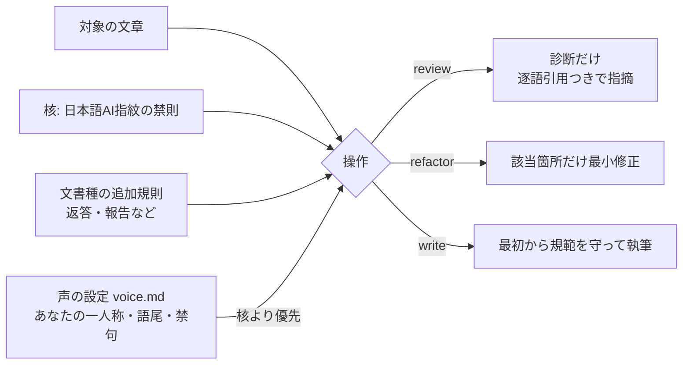

<p align="center">
  
  <br>
  <sub><em>均一に刷られた文章の中から必要な箇所だけを直し、書き手の声を戻す世界を表しています。</em></sub>
</p>

# unai

[](https://github.com/kitepon/unai/actions/workflows/ci.yml)
[](https://github.com/kitepon/unai/releases)
[](LICENSE)

**日本語** · [English](README.en.md)

> **AIが書いた日本語に、書き手を戻す。**
> unaiは、AI文章の癖を診断し、文章全体を書き直さず、該当箇所だけを最小修正するagent skillです。Claude Code、Codex、Grok、Cursorで動きます。

[kitepon.dev](https://kitepon.dev/#systems)所属の[クオ](https://x.com/QLyun35332)が開発・運営しています。

## 30秒でできること

```text
/unai review 下書き.md        # 問題箇所を診断する。文章は変更しない
/unai refactor 下書き.md      # 該当箇所だけを最小修正する
記事を書いて。unaiに従って     # 執筆時から規範を適用する
```

`review`は根拠と逐語引用を返し、`refactor`は指摘した箇所だけを直します。全文を別の文章へ
作り替えないので、元の主張、情報、構成、書き手の癖を残せます。

## なぜ日本語専用なのか

英語圏の同種ツールは、英語のAI文章に現れる癖を対象にしています。日本語には別の語彙、構文、
距離感、感情表現があるため、英語向けの規則を翻訳せず、日本語の実例から校正规範を作っています。

| | unai | [sepia](https://github.com/Nanako0129/sepia) | [humanizer](https://github.com/blader/humanizer) |
|---|---|---|---|
| 対象言語 | **日本語** | 英語 | 英語 |
| 直し方 | 診断→最小修正（書き直さない） | 3段パス（小説は構造から） | 35パターンの除去 |
| 書き手の声 | 声の設定で利用者ごとに差し込む | なし | 文体サンプルで調整 |
| 執筆時の適用 | あり（write） | あり | なし |

言い換え集ではなく、原因から直します。AIっぽさの根は「書き手の不在」——平均的で、賭けず、読者を信じず、感情を記号で演技する文章になること。unaiはその現れ方（指紋）を診断し、該当箇所だけを最小限で直します。

## 何を指紋と見なすか（抜粋）

- 「XではなくY」式の、否定の持ち出しの常用
- 英単語・識別子を日本語の文に刺し込む（1語ずつは正当でも、密度で文章が死ぬ）
- 「正直に言うと」「実は」式の保険の前置き
- 体言止めの乱発・ダッシュの溜め・雑誌ノリのキメ
- 「側」「層」「〜寄り」のような位置に寄せた歪んだ語彙
- 毎回同じ段落構成・毎段落末の絵文字・均一なぼかし語尾
- 「今後の動向に注目です」式のまとめの定型

全文は [skills/unai/references/core-pass.md](skills/unai/references/core-pass.md)。

同時に「直しすぎ」も指紋と見なします。禁則を全部守った均質な文章は、新しい不在です。unaiは最小修正を原則にします。

## インストール

### Claude Code

```bash
claude plugin marketplace add kitepon/unai
```

続けて対話中に `/plugin` からunaiをインストールするか:

```bash
claude plugin install unai@unai
```

### Codex / Grok / Cursor（Claude Codeでも可）

```bash
curl -fsSL https://raw.githubusercontent.com/kitepon/unai/main/install.sh | bash
```

Windows nativeではPowerShell 7から実行します。

```powershell
irm https://raw.githubusercontent.com/kitepon/unai/main/install.ps1 | iex
```

各ホストの部品置き場（`~/.claude/skills/unai` 等）へ繋ぎ込みます。導入していないホストは自動で飛ばします。更新は同じ1行の再実行。外すときは:

```bash
bash ~/.local/share/unai/install.sh --uninstall
```

installerは`unai` CLIも`~/.local/bin`へ配置します。版数と工場向けread-only診断は次の入口です。

```bash
unai --version
unai factory-diagnostics --json
```

## 使い方

```
/unai review 下書き.md        # 診断だけ（編集しない）
/unai refactor 下書き.md      # 該当箇所だけ最小修正
記事を書いて。unaiに従って     # 執筆時に最初から適用
```

AIからも呼べます。文章を書く作業の中で「unaiに従う」と指示されれば、AIが自分の出力に適用します。

### 適用範囲は3段階から選ぶ

1. **使う時だけ**（既定）: 導入しただけでは何も起きません。上の使い方のように呼んだ時だけ働きます
2. **特定のプロジェクトだけ常時**: そのプロジェクトの指示ファイルに下の1行を書くと、そのフォルダでの作業だけ言わなくても常時効きます。ブログのrepoにだけ効かせたい、といった使い方はこれです
3. **全部に常時**: ホストの共通指示に同じ1行を足すと、そのAIの全ての文章仕事に効きます

```
文章・返答の文体はunai skillの規範に従う。
```

1行を書く場所（ホスト別）:

| ホスト | プロジェクトだけ（2） | 全部（3） |
|---|---|---|
| Claude Code | `CLAUDE.md` | `~/.claude/CLAUDE.md` |
| Codex | `AGENTS.md` | `~/.codex/AGENTS.md` |
| Grok Build | `AGENTS.md` | `~/.grok/rules/AGENTS.md` |
| Cursor | `AGENTS.md` または `.cursor/rules/` | `~/.cursor/rules/` の規則ファイル |

置き場はホストの版によって変わることがあります。合わない場合は、そのホストの説明書で「指示ファイル／ルールファイル」の場所を確認してください。

## 声の設定（voice profile）

AIっぽさを消した後に「どんな声で書くか」はあなた自身のものです。`~/.unai/voice.md`（プロジェクト固有なら `.unai/voice.md`）に一人称・語尾・固有の禁句・許す崩しを書いておくと、unaiはそれを核より優先します。

```markdown
# 私の声
- 一人称は「俺」。「です・ます」は使わない。
- 読者は技術に詳しくない人も含む。専門用語は日本語の動きで説明する。
- 軽い冗談は可。自虐と偽の謙遜は不可。
```

書き方の詳細は [skills/unai/references/voice-profile.md](skills/unai/references/voice-profile.md)。

## 仕組み



## 構成

- `skills/unai/SKILL.md` — 操作（review / refactor / write）と手順
- `skills/unai/references/core-pass.md` — 日本語AI指紋の核（全文書種共通）
- `skills/unai/references/domains/chat-replies.md` — AIの返答・報告向けの追加規則
- `skills/unai/references/voice-profile.md` — 声の設定の書き方

文書種別の追加規則（ブログ記事・製品記事・SNS投稿）は、実測で検証してから順次足します。

## ライセンス

MIT

## サポートとセキュリティ

使い方や不具合は [GitHub Issues](https://github.com/kitepon/unai/issues) へ。脆弱性の報告は公開Issueへ書かず、[セキュリティポリシー](SECURITY.md) に従ってください。
